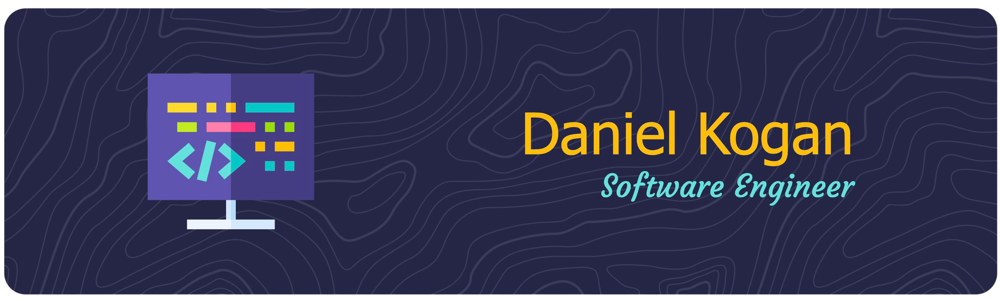

[](https://medium.com/@danielkoganx) [](https://linkedin.com/in/danielkogan123)

# Daniel Kogan

- Stony Brook '24
- Brooklyn Tech '21
- SWE Intern @ JP Morgan

# Summary

Master's student interested in Cloud Computing and Security. Worked at some cool companies like JP Morgan and CargoMatrix. Taken some cool courses like Network Security, OS, and Big Data. Queens, NY 📍


# Graphs

<div style="width: 100%">

[](https://github-readme-stats.vercel.app/api/top-langs/?username=daminals&langs_count=8&hide=html&layout=compact)
</div>

<!--START_SECTION:waka-->

```txt
From: 20 April 2024 - To: 27 April 2024

Python       10 hrs 37 mins  ██████████████████████░░░   88.47 %
Rust         1 hr 13 mins    ██▓░░░░░░░░░░░░░░░░░░░░░░   10.16 %
SSH Config   8 mins          ▒░░░░░░░░░░░░░░░░░░░░░░░░   01.11 %
JSON         1 min           ░░░░░░░░░░░░░░░░░░░░░░░░░   00.25 %
YAML         0 secs          ░░░░░░░░░░░░░░░░░░░░░░░░░   00.02 %
```

<!--END_SECTION:waka-->

# Achievements 


